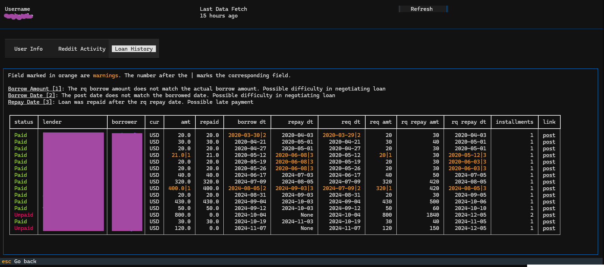

credditor
---------

Combines results from reddit, redditloans, and universal scan list APIs and produces a user report
in terminal.

- UI: [Textual](https://textual.textualize.io/).
- Reddit API: [PRAW](https://asyncpraw.readthedocs.io/en/stable/)
- Loan data: [LoansBot](https://github.com/LoansBot/loansbot)

## Usage

Input reddit username and load

See user overview, reddit activity, and loan history

## Setup & Run

- `python3 -m venv {path_to_project}`
- Run activate script from scripts dir
- Copy `.env.tpl` to `.env` and add reddit app credentials
- Install python requirements `pip3 install -r requirements.txt`
- Run with `python main.py {user_name}`

## Develop

- Terminal A: `textual console`
- Terminal B: `textual run --dev main.py`